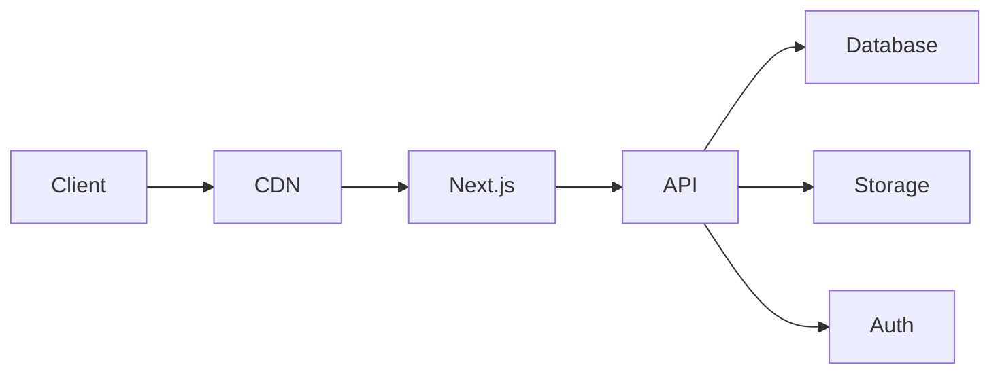
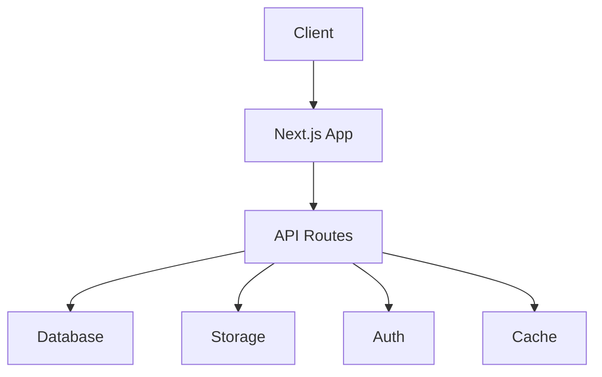

# Architecture du Système eCaution

## 1. Vue d'ensemble

eCaution est une application web moderne construite avec Next.js, utilisant une architecture microservices et une approche serverless.

## 2. Composants Principaux

### 2.1 Frontend
- **Framework**: Next.js 14
- **UI**: React avec Tailwind CSS
- **State Management**: Zustand
- **Formulaires**: React Hook Form
- **Validation**: Zod
- **Internationalisation**: next-intl

### 2.2 Backend
- **API Routes**: Next.js API Routes
- **Base de données**: PostgreSQL (Supabase)
- **Authentification**: Supabase Auth
- **Stockage**: Supabase Storage
- **Cache**: Redis

### 2.3 Infrastructure
- **Hébergement**: Vercel
- **CDN**: Vercel Edge Network
- **Monitoring**: Vercel Analytics
- **Logs**: Vercel Logs

## 3. Architecture Détaillée

### 3.1 Flux de Données

### 3.2 Structure des Services

## 4. Composants Techniques

### 4.1 Frontend
- **Pages**: App Router (Next.js 14)
- **Composants**: Atomic Design
- **Styles**: Tailwind CSS
- **Tests**: Jest + React Testing Library
- **Build**: Turborepo

### 4.2 Backend
- **API**: REST + GraphQL
- **Validation**: Zod
- **ORM**: Prisma
- **Cache**: Redis
- **Queue**: Bull

### 4.3 Base de Données
- **Type**: PostgreSQL
- **Hosting**: Supabase
- **Migrations**: Prisma Migrate
- **Backup**: Automatique quotidien

## 5. Sécurité

### 5.1 Authentification
- JWT avec rotation
- 2FA support
- OAuth providers
- Session management

### 5.2 Autorisation
- RBAC (Role-Based Access Control)
- Row Level Security
- API rate limiting
- CORS policies

## 6. Performance

### 6.1 Optimisations
- Edge caching
- Image optimization
- Code splitting
- Lazy loading

### 6.2 Monitoring
- Real-time metrics
- Error tracking
- Performance monitoring
- User analytics

## 7. Déploiement

### 7.1 CI/CD
- GitHub Actions
- Automated testing
- Preview deployments
- Production deployments

### 7.2 Environnements
- Development
- Staging
- Production
- Preview

## 8. Scalabilité

### 8.1 Horizontal Scaling
- Stateless architecture
- Load balancing
- Database sharding
- Cache distribution

### 8.2 Vertical Scaling
- Resource optimization
- Database optimization
- Cache optimization
- Asset optimization

## 9. Maintenance

### 9.1 Monitoring
- Health checks
- Error tracking
- Performance metrics
- User analytics

### 9.2 Backup
- Database backups
- File backups
- Configuration backups
- Disaster recovery

